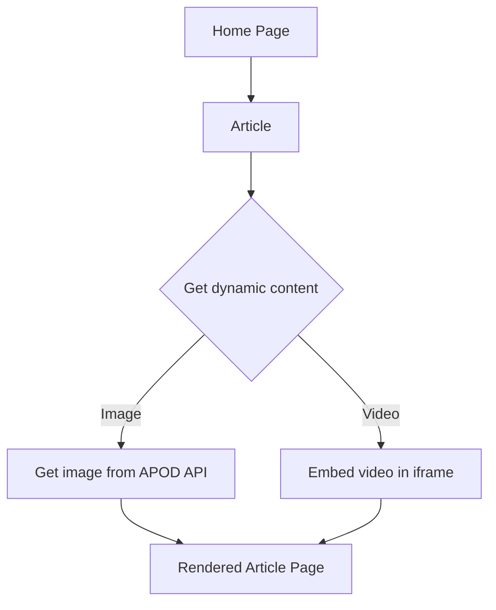

This is a [Next.js](https://nextjs.org) project bootstrapped with [`create-next-app`](https://nextjs.org/docs/app/api-reference/cli/create-next-app).

## Getting Started

First, run the development server:

```bash
npm run dev
# or
yarn dev
# or
pnpm dev
# or
bun dev
```

Open [http://localhost:3000](http://localhost:3000) with your browser to see the result.

## Diagram



## Possible improvements
* error boundaries
* loading between pages
* dynamic loading of date-fns locale
* additional UI adjustments 
* image optimizations 
* test coverage of utils 
* add home button
* add static resource localization (currently there is no need - 0 static resources)
* pagination
* dynamic data loading with translation API usage